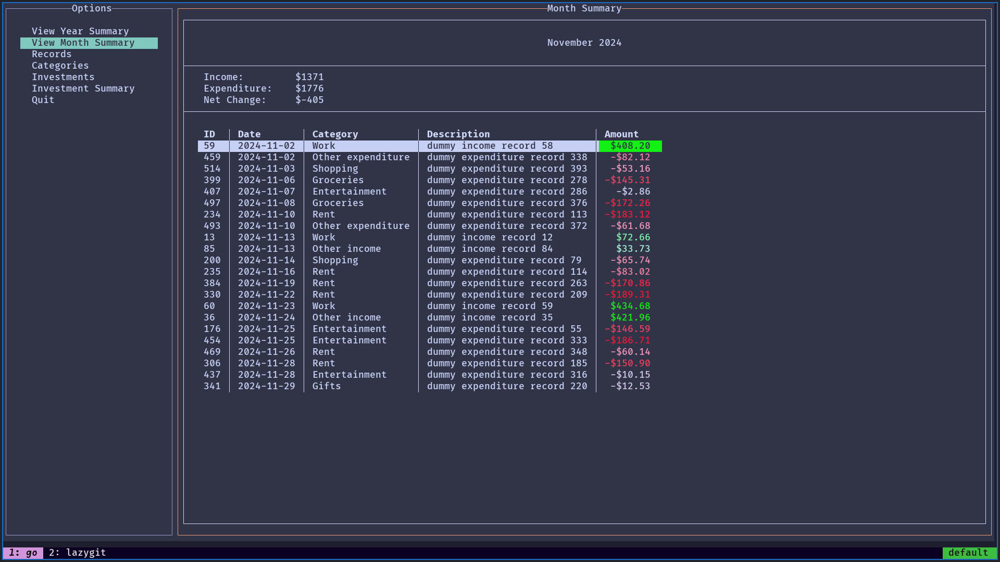
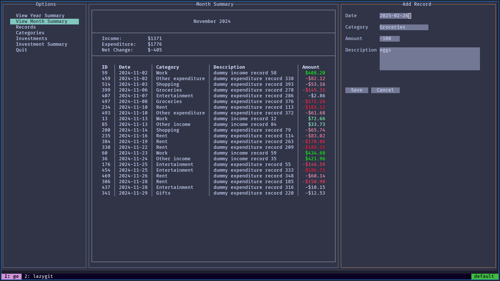
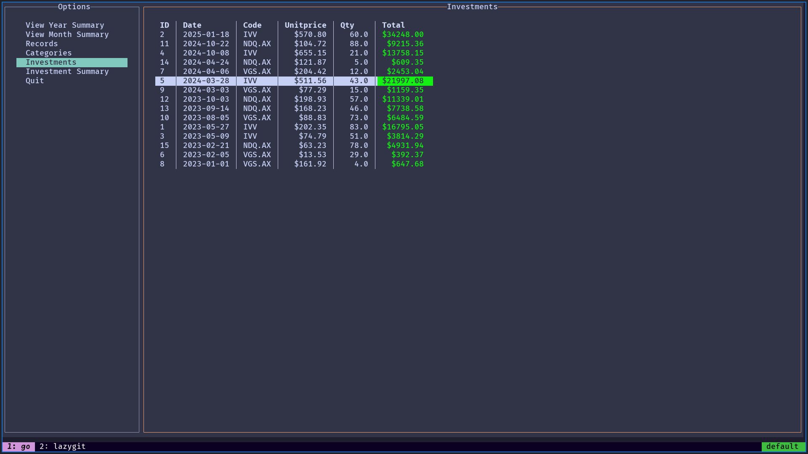

# Finance Tracker

A TUI finance tracker written in Go, using a sqlite database.

- Record your income and expenditure with custom categories, and see summaries in dashboard views for each month and year
- Record your investments, and see your profits with current stock prices pulled daily from [yahoo finance](https://au.finance.yahoo.com/)
- No financial data is stored within the app, everything is on a sqlite database which you can store anywhere for security and your peace of mind

## Known Bugs (currently working to fix)

- none (please submit a bug report if any are found!)

## Screenshots

## Quick Start

### Installation

#### Linux

1. Download the [finance-tracker](./finance-tracker) file
2. Open a terminal in the same directory, run `chmod +x finance-tracker`
3. Run the app using `./finance-tracker <path_to_db>`
    - choose any path you want to, may be relative or absolute
    - if the database doesn't exist yet, a new one will be created
    - if one already exists it will be opened

#### Bash Alias

To run the app without having to type in the full command each time, it is recommended to create an alias in your `.bashrc` file. This may look something like the following: `alias finances="finance-tracker ~/personal_documents/finances/finance-tracker.db"`. Once this is set up, the finance tracker may be started by running `finances` in the terminal.

### Updating

As the database is stored separately to the app, the app can simply be updated by downloading the latest version of the executable and replacing the old executable with the new one.

### Instructions

#### Running the App

- run `$ finance-tracker <path-to-database>`
    - `$ finance-tracker test.db`
    - `$ finance-tracker ~/folder1/folder2/test.db`
- creates a database if one doesn't exist at the path, if not opens the existing one

#### Controls (arrows or vim motions)

- navigation:
    - `j`/`k`/`↑`/`↓`/`g`/`G`: navigate lists/tables
    - `l`/`enter`: select a list item (make the table selectable)
    - `q`/`<C-c>`/`<C-q>`: back
    - `tab`/`<S-tab>`: next/previous item (must use this for forms when adding/editing)
    - `<C-d>`: quit
- when a table is focused:
    - `a`: add new item
    - `e`: edit selected item
    - `d`: delete selected item
    - `H`/`L` (capital): navigate back/forward a page
        - previous/next year/month for the summary pages
        - previous/next page for records/investments/categories
- shortcuts:
    - `y`: year view
    - `m`: month view
    - `r`: records
    - `c`: categories
    - `i`: investments

### Note on Investments

Investment data is pulled from [yahoo finance](https://au.finance.yahoo.com/). The stock code must match the stock code in yahoo finance for the particular stock. This can be found by searching for your stock on the yahoo finance website, and is important to get an accurate investment summary view.

Investment data is updated once daily and cached in the database. This makes the app more responsive when switching tabs.

## Features

- [ ] income / expenditure:
	- [X] record income/expenditure
	- [ ] use custom categories to query , e.g. charts of income/expenditure over time for a given category
	- [ ] filterable and sortable table view
- [X] investments:
	- [X] record buying/selling, and the buy/sell price
	- [X] gets the current stock price to show current value, profit/loss, etc.
- [X] summary displays:
	- [X] monthly summary of all records, total income/expenditure, and net value change
	- [X] yearly summary with totals by month and category
	- [X] investment summary, total quantity, average buy + current price, P/L, %P/L
- [X] responsive to terminal size

